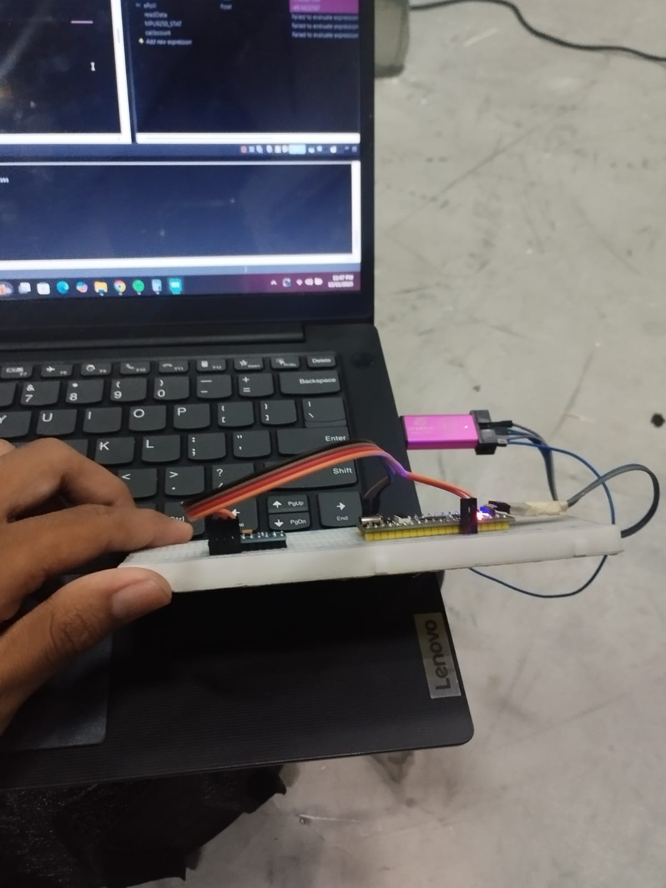
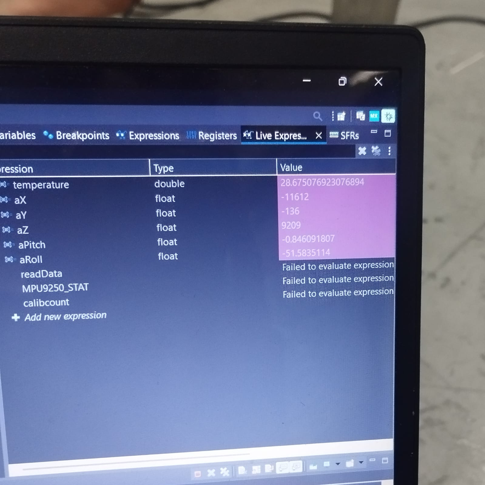
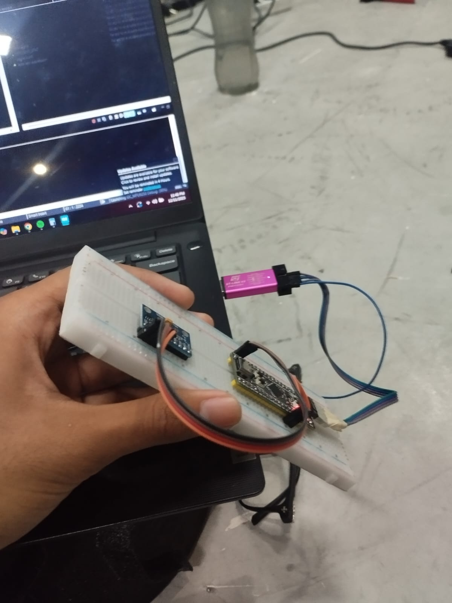
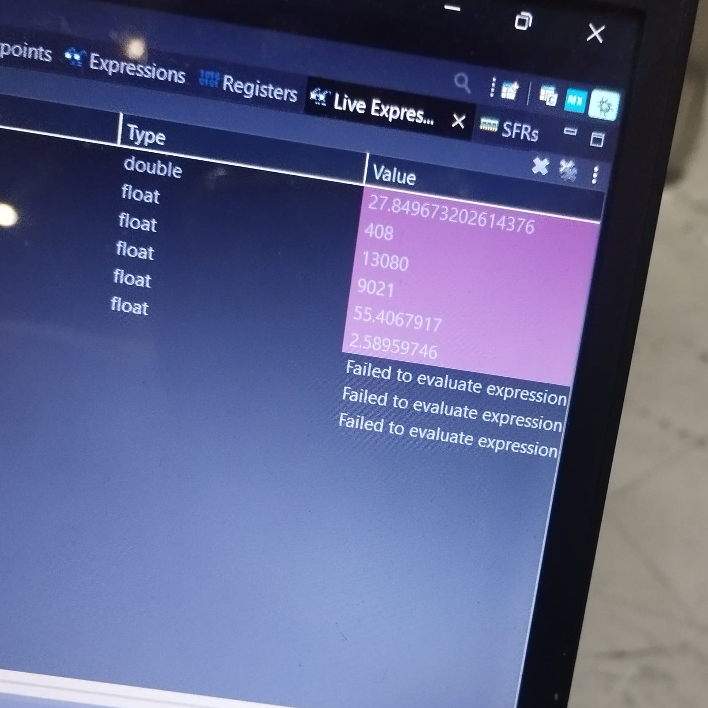

# DOCUMENTATION
A guide for anyone who wants to study and experiment with MPU 9250 and OLED ssd13106 using STM32F4xx. 

MPU 9250 Datasheet : https://invensense.tdk.com/wp-content/uploads/2015/02/MPU-9250-Register-Map.pdf

This program will display the reading results of the MPU 9250 to the OLED with I2C communication.

## Configuration
IOC Configuration I2C1 , I2C2 and ADC1

ADC Paramteter setting


I2C1 MPU Parameter setting


I2C2 OLED Parameter setting


- STM32F4XX OLED 12C connection
```
3V3 -> VCC
G -> GND
I2C2 (SCL/B10) -> SCL
I2C2 (SDA/B3) -> SDA
```

- STM32F4XX MPU 9250 I2C connection
```
3V3 -> VCC
G -> GND
I2C1 (SCL/B6) -> SCL
I2C1 (SDA/B7) -> SDA
```

## Create Global Variabel

Create a global variable like this to store the reading value MPU9250.
- `aX_RAW, aY_RAW, aZ_RAW, adcRAW[2] tempRAW` Raw data read.
- `aX, aY, aZ, aRoll, aPitch, tempMPU, aX1, aY1, aZ1` Data result.
```c
int16_t aX_RAW, aY_RAW, aZ_RAW, adcRAW[2], aX0, aY0, aZ0, tempRAW;
float aX, aY, aZ, aRoll, aPitch, tempMPU, aX1, aY1, aZ1;
```

Variable to store temperature reading results

```c
uint8_t AdcConvCmplt;
double temperature;
double VtmpSens;
double VrefInt;
double newTemperature;
```


## Define constant variable

### Temperature ADC value

```c
#define VREFINT 1.21
#define ADCMAX 4095.0
#define V25 0.76
#define AVG_SLOPE 0.0025
#define alpha 0.1
```
### MPU 9250 address used
- Used `MPU_ADDR` address `0xD0` if pin AD0 is GND and use address `0xD2` if pin AD0 is VCC. Address `0xD0` is recommended

```c
#define MPU_ADDR 0xD0
#define WHO_AM_I_REG 0x75
#define PWR_MGMT_1_REG 0x6B
#define SMPLRT_DIV_REG 0x19
#define ACCEL_CONFIG_REG 0x1C
#define ACCEL_XOUT_H 0x3B
```

## MPU 9250 Initial function
- `WHO_AM_I_REG` Read  I2C Connection : return `0x71` or `113` meaning the connection was successful.
- Change the `HAL_MAX_DELAY` value to set the I2C interrupt time.
- `SMPLRT_DIV_REG` address to configure sample rate. `Sample Rate = 1000 Hz / (1 + SMPLRT_DIV)`.
#### Example : 0x07
```
07 Hex = 7 Dec
Sample Rate = 1000 Hz / (1 + 7)
Sample Rate = 1000 Hz / 8
Sample Rate = 125 Hz
```
#### Example : 0x13
```
13 Hex = 19 Dec
Sample Rate = 1000 Hz / (1 + 19)
Sample Rate = 1000 Hz / 20
Sample Rate = 50 Hz
```
- `ACCEL_CONFIG_REG` address to configure accelerometer

#### Example : use 4g
Bin = 00001000 
#### Example : use 8g
Bin = 00010000
```c
void MPU_Init ()
{
    //Variables for storing return data and writing data
	uint8_t check, data;    

	HAL_I2C_Mem_Read(&hi2c1, MPU_ADDR, WHO_AM_I_REG, 1, &check, 1, HAL_MAX_DELAY);

	if (check == 104)

	{
		data = 0;
		HAL_I2C_Mem_Write(&hi2c1, MPU_ADDR, PWR_MGMT_1_REG, 1, &data, 1, HAL_MAX_DELAY);

		data = 0x07;
		HAL_I2C_Mem_Write(&hi2c1, MPU_ADDR, SMPLRT_DIV_REG, 1, &data, 1, HAL_MAX_DELAY);

		data = 0b00001100;
		HAL_I2C_Mem_Write(&hi2c1, MPU_ADDR, ACCEL_CONFIG_REG, 1, &data, 1, HAL_MAX_DELAY);

	}
}
```


## Accelerometer and Temperature MPU 9250 Read Function

- MPU9250 Temperature conversion formula : `Temp (°C) = (TEMP_OUT / 340) + 36.53`
- Variabel `aX` , `aY` , `aZ` Contains the final results of the sensor reading taking into account the offset 
```c
void MPU_Read_ACCEL ()
{
	uint8_t recData [8];    // Data Array to store accel reading data

    // Read accelerometer data
	HAL_I2C_Mem_Read(&hi2c1, MPU_ADDR, ACCEL_XOUT_H, 1, recData, 8, HAL_MAX_DELAY);

	// Conversion to Raw data 16 bit
    aX_RAW = (int16_t)(recData[0]<<8 | recData [1]);
	aY_RAW = (int16_t)(recData[2]<<8 | recData [3]);
	aZ_RAW = (int16_t)(recData[4]<<8 | recData [5]);
	tempRAW = (int16_t)(recData[6]<<8 | recData [7]);

	tempMPU = (tempRAW/340 + 36.53)/2;

	aX = (float)(aX_RAW+(-1*aX1)/2048.00);
	aY = (float)(aY_RAW+(-1*aY1)/2048.00);
	aZ = (float)(aZ_RAW+(2048.00 - aZ1)/2048.00);

	aRoll = (atan2 (aX,aZ))*57.2957795;
	aPitch = (atan2 (aY,aZ))*57.2957795;

}
```
### Roll
#### MPU9250 Perspective Axis

#### MPU9250 Roll Reading value

### Pitch
#### MPU9250 Perspective Axis

#### MPU9250 Pitch Reading value



## Accelerometer Calib Function

MPU_Calib_ACCEL is used to calibrate the Accelerometer with error values.
- Create `n` variable in global scope containing sample value.
- Create `calibcount` variable in global scope to store increments.
- `aX1` , `aY1` , `aZ1` Accelerometer ofset value variable on average reading.
- Replace `n` variable value to set sample average reading. 
```c

void MPU_Calib_ACCEL ()
{
    // Oled Display
    ssd1306_SetCursor(0, 0);
	ssd1306_WriteString("Calib", Font_7x10, White);

	uint8_t RECDATA [6];    // Data Array to store accel reading data 
	
	for (calibcount = 0; calibcount<n; calibcount++)
	{
		HAL_I2C_Mem_Read(&hi2c1, MPU_ADDR, ACCEL_XOUT_H, 1, RECDATA, 6, HAL_MAX_DELAY);

		aX0 = (int16_t)(RECDATA[0]<<8 | RECDATA [1]);
		aY0 = (int16_t)(RECDATA[2]<<8 | RECDATA [3]);
		aZ0 = (int16_t)(RECDATA[4]<<8 | RECDATA [5]);

		aX1 += aX0;
		aY1 += aY0;
		aZ1 += aZ0;	

		if (calibcount == n - 1)
		{
			aX1/=n;
			aY1/=n;
			aZ1/=n;
			break;
		}
	}
}
```

## ADC Callback function
```c
void HAL_ADC_ConvCpltCallback (ADC_HandleTypeDef* hadc)
{
	if (hadc->Instance == ADC1)
	{
		AdcConvCmplt =255;
	}
}
```

## I2C MPU and OLED init

Initialization MPU and OLED in main function.
- `MPU_Init()` Call MPU initializing function.
- `ssd1306_Init(&hi2c2);` Initializing OLED with library using I2C2 peripheral.
- To read display updates, the function `ssd1306_UpdateScreen(&hi2c2);` must be called.

```c
HAL_ADC_Start_DMA(&hadc1,(uint32_t *) adcRAW, 2);
HAL_TIM_Base_Start(&htim3);

ssd1306_Init(&hi2c2);
ssd1306_UpdateScreen(&hi2c2);

ssd1306_SetCursor(15, 15);
ssd1306_WriteString("Calib", Font_16x26, White);
ssd1306_UpdateScreen(&hi2c2);

MPU_Init();
HAL_Delay(1000);
ssd1306_UpdateScreen(&hi2c2);
```

## While Loop program
Inside the while loop there is the main execution program including displaying the MPU9250 sensor reading results to the OLED.

Create variable `blinkCount` in global scope.
`blinkCount` variable functions to create a program execution sequence in a loop.
```c
//Blink Count increments every 2ms
uint32_t blinkTime = HAL_GetTick();
if ((blinkTime % 2) == 0)
{
	blinkTime = 0;
	blinkCount++;
}
```

Create a buffer variable to store sensor reading data. 
```c
if (AdcConvCmplt)
{
	MPU_Read_ACCEL();
	VrefInt = (VREFINT*ADCMAX)/adcRAW[0];
	VtmpSens = (VrefInt*adcRAW[1])/ADCMAX;

	temperature =(VtmpSens - V25)/(AVG_SLOPE)+ 25.0;
	newTemperature = (alpha*temperature) + ((1-alpha)*newTemperature);
	AdcConvCmplt = 0;
}

char buff1[32];char buff2[32];char buff3[32];char buff4[32];
snprintf(buff1, sizeof(buff1), "Roll: %.2f", aRoll);
snprintf(buff2, sizeof(buff2), "Pitch: %.2f", aPitch);
snprintf(buff3, sizeof(buff3), "Temp MPU: %.2f", tempMPU);
snprintf(buff4, sizeof(buff4), "Temp STM: %.2f", newTemperature);
```

Execute the program according to the blinkCount value
```c

if (blinkCount >= 0 && blinkCount < 1)
{	// Display data in OLED
	ssd1306_SetCursor(0, 0);
	ssd1306_WriteString(buff1, Font_7x10, White);
	ssd1306_SetCursor(0, 15);
	ssd1306_WriteString(buff2, Font_7x10, White);
	ssd1306_SetCursor(0, 30);
	ssd1306_WriteString(buff3, Font_7x10, White);
	ssd1306_SetCursor(0, 45);
	ssd1306_WriteString(buff4, Font_7x10, White);
	ssd1306_UpdateScreen(&hi2c2);
}
else if (blinkCount>=1&&blinkCount<2)
{ 	// Display black in OLED
	ssd1306_UpdateScreen(&hi2c2);
	ssd1306_Fill(Black);
	ssd1306_UpdateScreen(&hi2c2);
}
else if (blinkCount ==2)
{	// Reset blinkCount
	blinkCount = 0;
}
```
